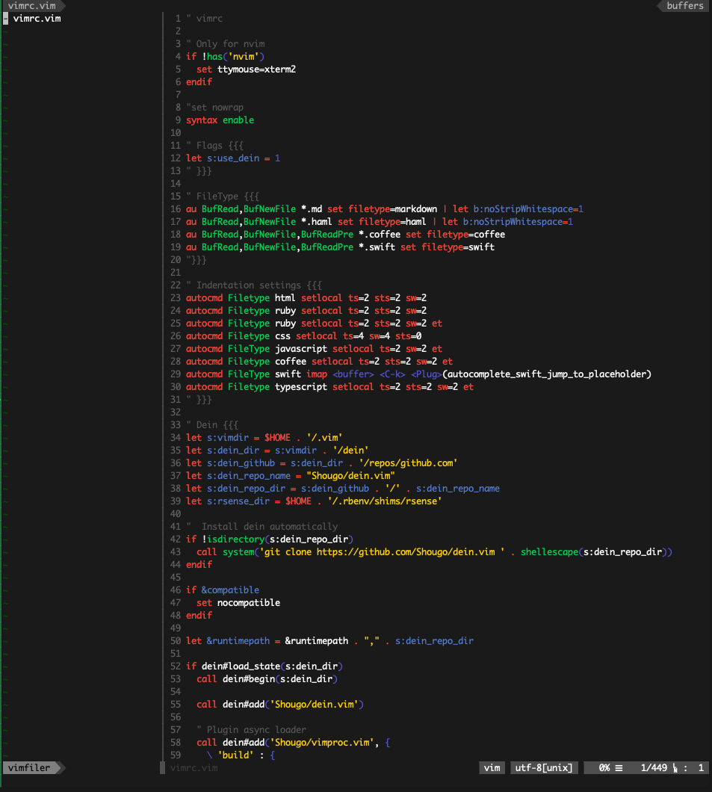

# vim-brogrammer-theme
Vim port of Sublime Text [Brogrammer theme](https://github.com/kenwheeler/brogrammer-theme).  
Extended from https://github.com/marciomazza/vim-brogrammer-theme

All credits to kenwheeler and marciomazza.

Changed some colors for neovim

## ITerms2 Color
[ITerms2 Color](https://github.com/mbadolato/iTerm2-Color-Schemes/blob/master/schemes/Brogrammer.itermcolors)

## Examples
### vim

### python

### c

### go

### java

### php

### ruby

### shell

